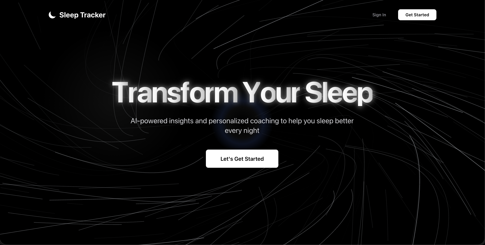

# 🌙 Sleep Tracker

A full-stack web application for tracking sleep patterns, analyzing sleep quality, and improving sleep habits with AI-powered insights and personalized coaching.



---

## 🚀 Features

### Core Functionality
- **Sleep Entry Management** - Log sleep and wake times with duration tracking
- **Interactive Dashboard** - Comprehensive overview of sleep patterns
- **Data Visualization** - Beautiful charts and analytics using Recharts
- **Export Capabilities** - Export sleep data to Excel/CSV formats

### User Experience
- **Dark Theme UI** - Immersive black hole vortex animation background
- **Responsive Design** - Works seamlessly on desktop and mobile devices
- **Real-time Updates** - Live data synchronization with Firebase
- **Authentication** - Secure user registration and login system

### Advanced Features
- **Sleep Analytics** - Detailed insights into sleep patterns and trends
- **AI Sleep Coach** - Personalized recommendations based on sleep data
- **Weekly Reports** - Automated weekly sleep quality summaries
- **Goal Tracking** - Set and monitor sleep improvement goals

---

## 🛠 Tech Stack

### Frontend
- **React 18** - Modern React with hooks and functional components
- **React Router** - Client-side routing and navigation
- **Tailwind CSS** - Utility-first CSS framework
- **Framer Motion** - Smooth animations and transitions
- **GSAP** - Advanced animations and scroll triggers
- **Recharts** - Data visualization and charting
- **React Icons** - Comprehensive icon library

### Backend
- **Node.js** - JavaScript runtime environment
- **Express.js** - Fast web application framework
- **Firebase Admin** - Server-side Firebase integration
- **JWT** - JSON Web Token authentication
- **bcrypt** - Password hashing and security

### Database & Services
- **Firebase Realtime Database** - Real-time data synchronization
- **Firebase Authentication** - User management and security

---

## 📦 Installation

### Prerequisites
- Node.js (v14 or higher)
- npm or yarn package manager
- Firebase project setup

### Setup Instructions

1. **Clone the repository**
   ```bash
   git clone https://github.com/Arjun140205/Sleep-tracker.git
   cd Sleep-tracker
   ```

2. **Install server dependencies**
   ```bash
   cd server
   npm install
   ```

3. **Install client dependencies**
   ```bash
   cd ../client
   npm install
   ```

4. **Configure Firebase**
   - Create a Firebase project at [Firebase Console](https://console.firebase.google.com)
   - Download service account key and place in `server/config/serviceAccountKey.json`
   - Or set environment variables in `server/.env`:
     ```env
     FIREBASE_PROJECT_ID=your_project_id
     FIREBASE_PRIVATE_KEY=your_private_key
     FIREBASE_CLIENT_EMAIL=your_client_email
     ```

5. **Start the application**
   
   **Server** (Port 5001):
   ```bash
   cd server
   npm start
   ```
   
   **Client** (Port 3000):
   ```bash
   cd client
   npm start
   ```

---

## 🔧 Configuration

### Environment Variables
Create a `.env` file in the server directory:

```env
# Firebase Configuration
FIREBASE_PROJECT_ID=your_project_id
FIREBASE_PRIVATE_KEY=your_private_key
FIREBASE_CLIENT_EMAIL=your_client_email
FIREBASE_DATABASE_URL=https://your-project.firebaseio.com

# JWT Configuration
JWT_SECRET=your_jwt_secret_key
```

### Firebase Setup
Follow the detailed setup guide in [FIREBASE_SETUP.md](./FIREBASE_SETUP.md) for complete Firebase configuration instructions.

---

## 📁 Project Structure

```
Sleep-tracker/
├── client/                 # React frontend application
│   ├── src/
│   │   ├── components/     # Reusable UI components
│   │   ├── pages/         # Application pages
│   │   ├── utils/         # Utility functions
│   │   └── lib/           # Shared libraries
│   └── public/            # Static assets
├── server/                # Node.js backend application
│   ├── config/           # Configuration files
│   ├── controllers/      # Route controllers
│   ├── middlewares/      # Express middlewares
│   ├── routes/          # API route definitions
│   └── server.js        # Main server file
└── README.md
```

---

## 🔗 API Endpoints

### Authentication
- `POST /api/auth/signup` - User registration
- `POST /api/auth/login` - User login

### Sleep Entries
- `GET /api/entries` - Get user's sleep entries
- `POST /api/entries` - Create new sleep entry

### Health Check
- `GET /api/health` - Server health status

---

## 🎯 Usage

1. **Sign Up** - Create a new account with email and password
2. **Dashboard** - Access your personal sleep tracking dashboard
3. **Log Sleep** - Record your sleep and wake times
4. **View Analytics** - Analyze your sleep patterns with interactive charts
5. **Export Data** - Download your sleep data for external analysis
6. **Track Goals** - Set and monitor sleep improvement objectives

---

## 🤝 Contributing

1. Fork the repository
2. Create a feature branch (`git checkout -b feature/amazing-feature`)
3. Commit your changes (`git commit -m 'Add amazing feature'`)
4. Push to the branch (`git push origin feature/amazing-feature`)
5. Open a Pull Request

---

## 📄 License

This project is licensed under the MIT License - see below for details:

```
MIT License

Copyright (c) 2024 Sleep Tracker

Permission is hereby granted, free of charge, to any person obtaining a copy
of this software and associated documentation files (the "Software"), to deal
in the Software without restriction, including without limitation the rights
to use, copy, modify, merge, publish, distribute, sublicense, and/or sell
copies of the Software, and to permit persons to whom the Software is
furnished to do so, subject to the following conditions:

The above copyright notice and this permission notice shall be included in all
copies or substantial portions of the Software.

THE SOFTWARE IS PROVIDED "AS IS", WITHOUT WARRANTY OF ANY KIND, EXPRESS OR
IMPLIED, INCLUDING BUT NOT LIMITED TO THE WARRANTIES OF MERCHANTABILITY,
FITNESS FOR A PARTICULAR PURPOSE AND NONINFRINGEMENT. IN NO EVENT SHALL THE
AUTHORS OR COPYRIGHT HOLDERS BE LIABLE FOR ANY CLAIM, DAMAGES OR OTHER
LIABILITY, WHETHER IN AN ACTION OF CONTRACT, TORT OR OTHERWISE, ARISING FROM,
OUT OF OR IN CONNECTION WITH THE SOFTWARE OR THE USE OR OTHER DEALINGS IN THE
SOFTWARE.
```

---

## 💡 Acknowledgments

- Inspired by modern sleep science and wellness applications
- Built with React and Firebase for optimal performance
- UI animations powered by Framer Motion and GSAP
- Icons provided by React Icons library

---

**Made with ❤️ for better sleep**